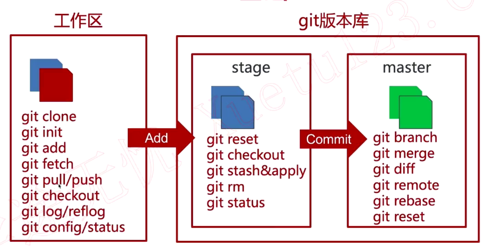

#    Git

## git本地ssh配置

配置远程git地址、密钥

.ssh/config文件：

```git
Host yang-github

​	Hostname github.com

​	User yangxin6

​	PreferredAuthentications publickey

​	IdentityFile /Users/mac/.ssh/key/github_deploy/id_rsa
```

更改 git@yang-tihub:yangxin6/learngit-1.git

## Git 仓库创建

### .gitignore

以斜杠`/`开头表示目录；
以星号`*`通配多个字符；
以问号`?`通配单个字符
以方括号`[]`包含单个字符的匹配列表；
以叹号`!`表示不忽略(跟踪)匹配到的文件或目录；

### git管理.gitignore


```git
git config core.excludesfile .gitignore
```


### 让Git识别该配置文件

### 空仓库创建

```git
echo "# test" >> README.md
git init
git remote add origin git@github.com:yangxin6/test.git
git add README.md
git commit -m "first commit"

git push -u origin master
```

### 多个仓库提交

```
git remote add origin1 git@github.com:yangxin6/test.git
git push -u origin1 master
```

## Git 基础



git pull 更新命令 把远程仓库拉取到本地，会提示出现冲突

git log/reflog 日志

git stash 保存缓存区的文件不做提交

git stash apply 找回缓存区文件


git log 远程提交的

git reflog 本地的提交 所有操作

git config --global --list 全局信息

git config --global user.name "yx"

git config --global user.email "xxxx"


git branch dev 新建本地分支

`git checkout dev` 切换到 dev 分支

`git reset --hard 321a724` 回退 （改变了log，reflog会记录此次操作）

`git diff` 查看更改


 

## Git 分支管理

`git branch dev` 从master分支复制一份代码

`git branch -D dev` 删除分支从当前分支复制一份代码，创建并切换到dev分支

` git pull origin dev` 拉取dev分支下的代码把不同的内容输出在文件中

`git fetch origin dev` 拉取dev分支下的代码把不同的内容输出在FETCH_HEAD 文件夹中

`git merge FETCH_HEAD` 把本地代码修改为FETCH_HEAD中的不同代码

`git fetch origin feature:dev1` 把远程 feature分支复制到本地dev1分支下，如果dev1不存在则创建dev1分支

`git pull origin feature` 把远程 feature分支复制并合并到本地dev分支下

`git reset --hard head^` 回退上一次提交

`git reset --hard 727e2d9` 返回到727e2d9这次操作

`git reset --hard head~0` 返回到HEAD@{0}:这次操作

`git tag v1.0.0` 给当前的分支打上tag

 `git tag -d v1.0.0` 删除本地v1.0.0

`git tag -l` 查看tag列表  

`git push origin :refs/tags/v1.0.0` 删除远程v1.0.0

`git push origin :feature` 删除远程feature分支

`git branch -D feature` 删除本地分支

`git add .`之后可以采用`git reset HEAD test2.txt`让`git commit -m`没有test2.txt文件

`git checkout test1.txt` 或者 `git restore test1.txt`返回到修改之前的状态


## 常用命令

```git
git checkout -b netty  # 新建本地分支
git pull --rebase origin master		# 代码合并
git tag v1.0.0										# 本地分支打标签
git push origin --tags						# 把本地所有 tags 传到服务器
git push origin v1.0 						  # 把本地 v1.0  tags 传到服务器
git push origin :dev							# 删除远程 dev 分支

git branch dev 										# 新建本地分支 从master分支复制一份代码
git checkout dev 									# 切换到 dev 分支
git push origin dev								# 推送分支
```


## 搭建Gitlab

sudo docker run --detach --hostname 10.211.55.15 --publish 13800:80 --publish 13443:443 --publish 13822:22 --name gitlab --restart always --volume /mydata/gitlab/config:/etc/gitlab --volume /mydata/gitlab/logs:/var/log/gitlab --volume /mydata/gitlab/data:/var/opt/gitlab gitlab/gitlab-ce:latest

### 文件 docker-compose.yml

```yaml
version: '2.3'

services:
  redis:
    restart: always
    image: redis:5.0.9
    command:
    - --loglevel warning
    volumes:
    - /mydata/redis:/var/lib/redis:Z

  postgresql:
    restart: always
    image: sameersbn/postgresql:11-20200524
    volumes:
    - /mydata/postgresql:/var/lib/postgresql:Z
    environment:
    - DB_USER=gitlab
    - DB_PASS=password
    - DB_NAME=gitlabhq_production
    - DB_EXTENSION=pg_trgm

  gitlab:
    restart: always
    image: sameersbn/gitlab:13.0.6
    depends_on:
    - redis
    - postgresql
    ports:
    - "13880:80"
    - "13822:22"
    volumes:
    - /mydata/gitlab:/home/git/data:Z
    healthcheck:
      test: ["CMD", "/usr/local/sbin/healthcheck"]
      interval: 5m
      timeout: 10s
      retries: 3
      start_period: 5m
    environment:
    - DEBUG=false

    - DB_ADAPTER=postgresql
    - DB_HOST=postgresql
    - DB_PORT=5432
    - DB_USER=gitlab
    - DB_PASS=password
    - DB_NAME=gitlabhq_production

    - REDIS_HOST=redis
    - REDIS_PORT=6379

    - TZ=Asia/Kolkata
    - GITLAB_TIMEZONE=Kolkata

    - GITLAB_HTTPS=false
    - SSL_SELF_SIGNED=false

    - GITLAB_HOST=10.211.55.15
    - GITLAB_PORT=13880
    - GITLAB_SSH_PORT=13822
    - GITLAB_RELATIVE_URL_ROOT=
    - GITLAB_SECRETS_DB_KEY_BASE=long-and-random-alphanumeric-string
    - GITLAB_SECRETS_SECRET_KEY_BASE=long-and-random-alphanumeric-string
    - GITLAB_SECRETS_OTP_KEY_BASE=long-and-random-alphanumeric-string

    - GITLAB_ROOT_PASSWORD=yangXIN.
    - GITLAB_ROOT_EMAIL=yangxinnc@163.com

    - GITLAB_NOTIFY_ON_BROKEN_BUILDS=true
    - GITLAB_NOTIFY_PUSHER=false

    - GITLAB_EMAIL=notifications@example.com
    - GITLAB_EMAIL_REPLY_TO=noreply@example.com
    - GITLAB_INCOMING_EMAIL_ADDRESS=reply@example.com

    - GITLAB_BACKUP_SCHEDULE=daily
    - GITLAB_BACKUP_TIME=01:00

    - SMTP_ENABLED=false
    - SMTP_DOMAIN=www.example.com
    - SMTP_HOST=smtp.gmail.com
    - SMTP_PORT=587
    - SMTP_USER=mailer@example.com
    - SMTP_PASS=password
    - SMTP_STARTTLS=true
    - SMTP_AUTHENTICATION=login

    - IMAP_ENABLED=false
    - IMAP_HOST=imap.gmail.com
    - IMAP_PORT=993
    - IMAP_USER=mailer@example.com
    - IMAP_PASS=password
    - IMAP_SSL=true
    - IMAP_STARTTLS=false

    - OAUTH_ENABLED=false
    - OAUTH_AUTO_SIGN_IN_WITH_PROVIDER=
    - OAUTH_ALLOW_SSO=
    - OAUTH_BLOCK_AUTO_CREATED_USERS=true
    - OAUTH_AUTO_LINK_LDAP_USER=false
    - OAUTH_AUTO_LINK_SAML_USER=false
    - OAUTH_EXTERNAL_PROVIDERS=

    - OAUTH_CAS3_LABEL=cas3
    - OAUTH_CAS3_SERVER=
    - OAUTH_CAS3_DISABLE_SSL_VERIFICATION=false
    - OAUTH_CAS3_LOGIN_URL=/cas/login
    - OAUTH_CAS3_VALIDATE_URL=/cas/p3/serviceValidate
    - OAUTH_CAS3_LOGOUT_URL=/cas/logout

    - OAUTH_GOOGLE_API_KEY=
    - OAUTH_GOOGLE_APP_SECRET=
    - OAUTH_GOOGLE_RESTRICT_DOMAIN=

    - OAUTH_FACEBOOK_API_KEY=
    - OAUTH_FACEBOOK_APP_SECRET=

    - OAUTH_TWITTER_API_KEY=
    - OAUTH_TWITTER_APP_SECRET=

    - OAUTH_GITHUB_API_KEY=
    - OAUTH_GITHUB_APP_SECRET=
    - OAUTH_GITHUB_URL=
    - OAUTH_GITHUB_VERIFY_SSL=

    - OAUTH_GITLAB_API_KEY=
    - OAUTH_GITLAB_APP_SECRET=

    - OAUTH_BITBUCKET_API_KEY=
    - OAUTH_BITBUCKET_APP_SECRET=

    - OAUTH_SAML_ASSERTION_CONSUMER_SERVICE_URL=
    - OAUTH_SAML_IDP_CERT_FINGERPRINT=
    - OAUTH_SAML_IDP_SSO_TARGET_URL=
    - OAUTH_SAML_ISSUER=
    - OAUTH_SAML_LABEL="Our SAML Provider"
    - OAUTH_SAML_NAME_IDENTIFIER_FORMAT=urn:oasis:names:tc:SAML:2.0:nameid-format:transient
    - OAUTH_SAML_GROUPS_ATTRIBUTE=
    - OAUTH_SAML_EXTERNAL_GROUPS=
    - OAUTH_SAML_ATTRIBUTE_STATEMENTS_EMAIL=
    - OAUTH_SAML_ATTRIBUTE_STATEMENTS_NAME=
    - OAUTH_SAML_ATTRIBUTE_STATEMENTS_USERNAME=
    - OAUTH_SAML_ATTRIBUTE_STATEMENTS_FIRST_NAME=
    - OAUTH_SAML_ATTRIBUTE_STATEMENTS_LAST_NAME=

    - OAUTH_CROWD_SERVER_URL=
    - OAUTH_CROWD_APP_NAME=
    - OAUTH_CROWD_APP_PASSWORD=

    - OAUTH_AUTH0_CLIENT_ID=
    - OAUTH_AUTH0_CLIENT_SECRET=
    - OAUTH_AUTH0_DOMAIN=
    - OAUTH_AUTH0_SCOPE=

    - OAUTH_AZURE_API_KEY=
    - OAUTH_AZURE_API_SECRET=
    - OAUTH_AZURE_TENANT_ID=

```

### 手动备份

```bash
docker-compose run --rm gitlab app:rake gitlab:backup:create
```

### 恢复

查看可用的备份：（选择恢复）

```bash
docker-compose run --rm gitlab app:rake gitlab:backup:restore
```


恢复备份：

```bash
docker-compose run --rm gitlab app:rake gitlab:backup:restore BACKUP=1515629493_2020_12_06_13.0.6
```

