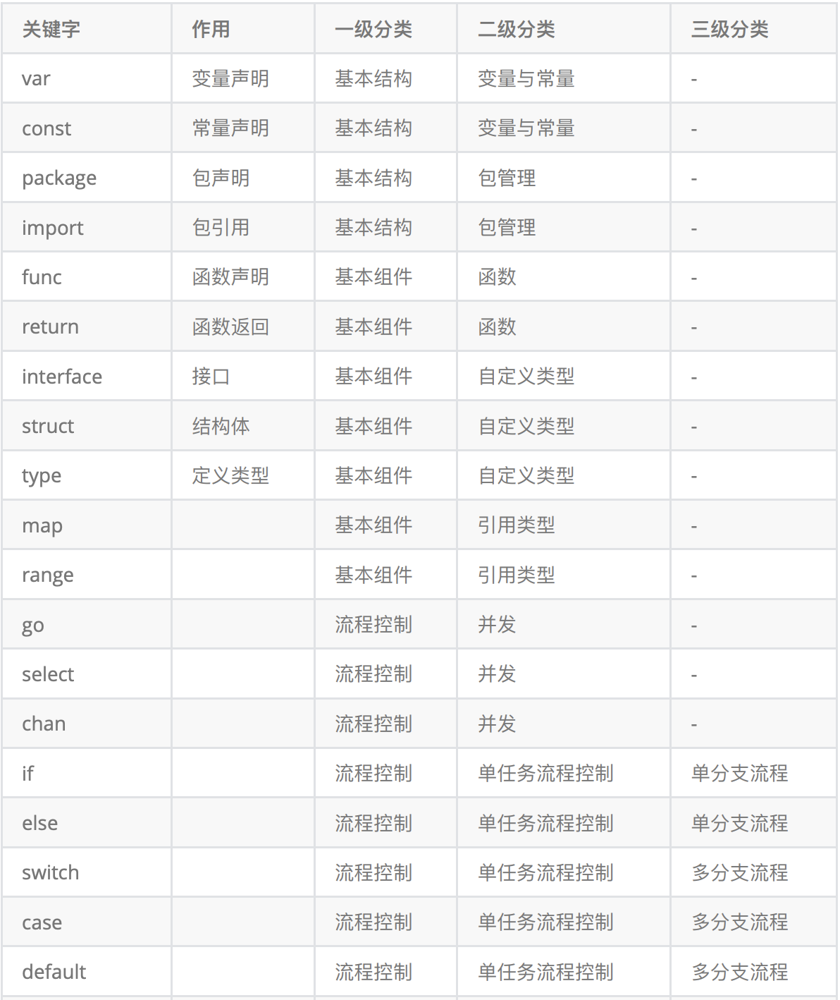

# 关键字

## Go语言关键字




### 变量与常量

#### 变量

```go
var a int = 10
var b = 20
// 自动推导类型
c := 20
// 多重赋值
a,b,c := 1,true,"str"
// 变量交换
a1 := 123
a2 := 666
a1, a2 = a2, a1
// 打印数据类型
fmt.Printf("%T\n",c)
```

#### 常量

```go
const PI = 3.1415
```

常量集 枚举

```go
const (
		a = iota
		b = iota
		c
		d
		e, f, g = iota, iota, iota
	)

// 0 1 2 3 4 4 4

const(
	a = 123
  b = true
  c = "qweqwe"
  d = 1.123
)
```

### 包 imort

```go
import(
	"fmt",
  fdemo "demo"
  _ "demo"		// 使用包的初始化或接口实现 并没有明显的调用 使用_来区分
)
```

### 函数

格式

```go
func 函数名 (函数参数列表)(返回值列表){
  // 代码体
  // 返回值 return
}
```


匿名函数

必须在函数内部定义

```go
func 函数名 (函数参数列表)(返回值列表){
  // 代码体
  // 返回值 return
}()
```

```go
// 匿名函数
func main (){

   // 定义并调用匿名函数
   func(a int, b int){
      fmt.Println(a + b)
   }(10, 20)

   // 函数类型变量
   f := func(a int, b int) {
      fmt.Println(a + b)
   }
   fmt.Printf("%T\n", f)
   // 定义函数类型
   var f1 func(int, int)
   f1 = func(a int, b int) {
      fmt.Println(a + b)
   }
   fmt.Printf("%T\n", f1)

   // 调用函数
   f(10, 30)
   fmt.Printf("%T\n", f)
}
```


###  type/interface /struct

#### type

1. 为已存在的数据类型起别名
2. 为函数定义类型

```go
// 2、为函数定义类型
type FUNCTYPE func(int , bool, string)
func demo1 (a int, b bool, c string){
   fmt.Println(a, b, c)
}
// 函数回调
func demo2(f FUNCTYPE){
   f(1, false, "demo2")
}
func main() {
   // type
   // 1、为已存在的数据类型起别名
   type i8 int8
   type ii8 = int8
   var a int8 = 1
   var b i8 = 123
   var c ii8 = 1
   fmt.Println(a)
   fmt.Printf("%T\n",a)
   fmt.Println(b)
   fmt.Printf("%T\n",b)
   //fmt.Println(a+b) //error 数据类型不一样
   fmt.Println(a+c)

   // byte 字符类型
   var ch byte = 'a'
   fmt.Println(ch)


   // 2、为函数定义类型
   var f FUNCTYPE
   // 将函数赋值给函数类型的变量
   f = demo1
   f(1,false,"a")

   demo2(f)
}
```


#### interface 

接口、空接口

```go
func main04()  {
   // 空接口类型 接受任意类型数据
   var a interface{}
   //var b interface{} = 456
   a = 123
   a = 1.234
   a = "hello"
   fmt.Println(a)
   //fmt.Println(a+b) //error

   // 通过反射空接口数据对应的类型
   t := reflect.TypeOf(a)
   fmt.Println(t)
   // 通过反射空接口数据对应的值
   v := reflect.ValueOf(a)
   fmt.Println(v)
   fmt.Printf("%T\n", v) //reflect.Value 不能计算
   //fmt.Println(v + 123) //error

   // 类型断言
   // 接口类型变量(数据类型)
   a1, ok := a.(string)
   fmt.Println(a1)
   fmt.Println(ok)
   fmt.Printf("%T\n", a1)
   fmt.Println(a1+"123")
}
```

#### struct

结构体

大写对外暴露 

小写包内可见

```go
// 结构体定义
/*
type 结构体名 struct{
   // 结构体变量成员
   变量名 数据类型
}
 */
type Student struct {
   id int
   name string
   //sex rune // '男' 单引号里面中文
   sex string
   score int
   addr string
}

func main()  {
   // 结构体初始化
   var stu Student
   stu.id = 11
   //stu.sex = '男' // 30007
   stu.sex = "男"
   stu.addr = "河南省"
   stu.name = "张三"
   stu.score = 123
   fmt.Println(stu)
}
```


### defer

延迟调用

```go
defer fmt.Println(1)
defer fmt.Println(2)
fmt.Println(3)
defer fmt.Println(4)
// 3 4 2 1
```


## 命名规则

1. 允许使用 字母 数字 下划线 （中文不建议）
2. 区分大小写
3. 不允许数字开头
4. 不允许使用关键字


### 驼峰命名

小驼峰

大驼峰


首字母大写 包外可见

​			小写 包内可见


## 数据类型


- string  一个汉字占三个字节
- 连接字符串 + 
- 使用 ``不转义 \n等
- 类型转换 `float(12)` 不会有四舍五入


### 数组

go语言数据是 按值传递 

赋值和函数传递过程是值复制，涉及到内存copy，性能低

### 切片

```go
// var 切片名 []数据类型
// var slice [] int // nil

// make([]数据类型, 长度, 容量)
slice1 := make([]int, 10, 30)
```

建议使用切片代替数组

动态数组

#### Append

`append()`  为切片添加内容 

​					当长度小于容量时 地址不变

​								大于容量时 地址改变   当大小 小于 1024时 扩容为原来的2倍

​																					大于 1024时 扩容为原来的1.25倍

使用

```go
func BubbleSort(slice []int){
   fmt.Printf("BubbleSort1  %p\n", slice)  // 0xc00001a140
   for i := 0; i < len(slice)-1; i++ {
      for j := 0; j < len(slice) - 1 - i; j++ {
         if slice[j] > slice[j+1] {
            slice[j], slice[j+1] = slice[j+1], slice[j]
         }
      }
   }
   fmt.Printf("BubbleSort2  %p\n", slice)   //  0xc00001a140
}

func testAppend(slice []int){
   fmt.Printf("testAppend1  %p\n", slice)	  //  0xc00001a140
   slice = append(slice, 1,2,3,4,5)
   fmt.Println(slice)												// [0 1 2 2 3 4 6 9 1 2 3 4 5]
   fmt.Printf("testAppend2  %p\n", slice)		//  0xc000070000
}
func main()  {
   slice1 := []int{4,6,9,1,2,0,3,2}
   fmt.Printf("main1  %p\n", slice1) //  0xc00001a140
   BubbleSort(slice1)
   fmt.Printf("main2  %p\n", slice1) //  0xc00001a140
   fmt.Println(slice1)							 //		[0 1 2 2 3 4 6 9]
   testAppend(slice1)
   fmt.Printf("main3  %p\n", slice1) //  0xc00001a140
   fmt.Println(slice1)							 // [0 1 2 2 3 4 6 9]
}
```

#### 切片截取和拷贝

左闭右开

`s := slice[2:5]`

```go
// 切片截取和拷贝
slice := []int{4, 6, 9, 1, 2, 0, 3, 2}
// 地址的偏移
s := slice[2:5]
fmt.Println(s)

fmt.Printf("%p\n",slice)
fmt.Printf("%p\n",s)

[9 1 2]
0xc00011a000
0xc00011a010

// 切片的拷贝 深拷贝
var s1 []int = make([]int, 10, 20)
copy(s1, slice)
fmt.Println(s1)
s1[2] = 111
fmt.Println(s1)
fmt.Printf("%p\n",slice)
fmt.Printf("%p\n",s)、


[4 6 9 1 2 0 3 2 0 0]
[4 6 111 1 2 0 3 2 0 0]
0xc0000b8000
0xc0000b8010
```


### map

map 的 key 必须支持 == != 运算操作 不可一世函数 map 切片

无序

### 指针

指针类型在 32 位操作系统占 4字节

指针类型在 64 位操作系统占 8字节

内存地址是一个无符号 16 进制整型数据


内存地址编号 0-255为系统占用不允许用户读写操作

只读存储器 随机存储器


`new` 创建内存空间 不需要关心释放问题 有自己的垃圾回收机制


## 流程控制

`if else`

`switch`

if/else/switch/default/fallthrough

1. switch 中的 case 不允许是浮点型 （浮点型相对精准）
2. 执行相同内容 可以使用逗号分割

```go
switch value{
  case 1: 
  	// 不需要使用 break
  case 1, 2, 4:
  	// 
  	fallthrough // 让当前case向下执行
  default:
  //
}
```

没有单目运算符 ++ -- 

三目也没有


for 循环 


