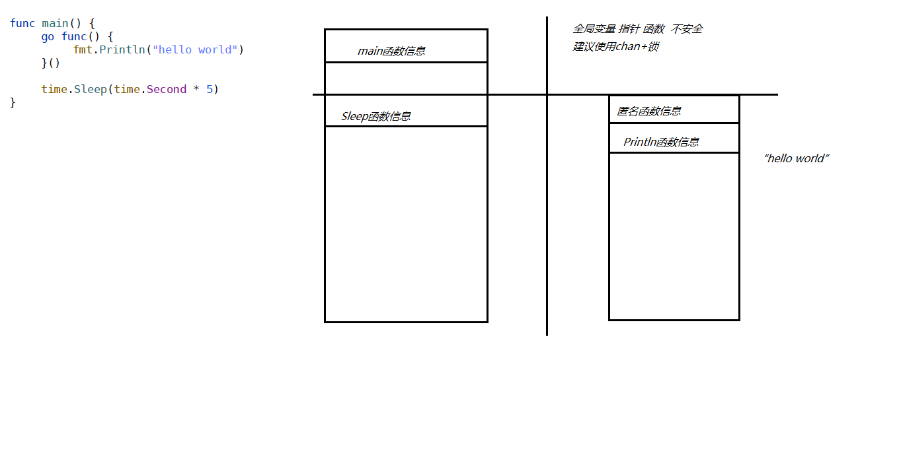

# 并发编程

## 并发与并行

- 并发 Concurrency 逻辑上具备同时处理多个人物的能力
- 并⾏ Parallelism 物理上在同⼀时刻执⾏多个并发任务


## 并发Goroutine

- Go 的并发通过 Goroutine 实现，Goroutine 不等同于协程Coroutine，⽽是两级线程模型，也称混合型线程模型
- 主流线程模型
  - 内核级线程模型
  - ⽤户级线程模型 Coroutine
  - 两级线程模型 Goroutine

- 线程默认的栈是 MB 级别， Goroutine 默认 2K

- 使⽤Goroutine

```go
go func() {
		fmt.Println("Goroutine")
 }()
```



## 并发Channel

- 接受⽅向、数据类型、Buffffer ⼤⼩

- ch1 := make(chan int) // 双向的 channel 可以⽤来收发，类型是 int

- 单向的 channel 主要⽤于函数传递的安全因素，类似于 const ⼀般不直接声明

- ch2 := make(chan<- int) // 接受的 channel 可以⽤来收发，类型是 int

- ch3 := make(<-chan int) // 发送的 channel 可以⽤来收发，类型是 int

- ch4 := make(chan int, 100) // 双向的 channel 可以⽤来收发，类型是 int，⼤⼩ 100

  

  

### Channel的使⽤

- ch := make(chan int) // 双向的 channel ，类型是 int
- ch <- 1 // 写⼊数据
- a := <-ch // 读取数据
- 通道不再使⽤的时候可以调⽤ close 函数进⾏关闭
- close(ch) // 关闭事件会通知到所有等在在 ch 上的 goroutine， 不能关闭仅是接收⽅的 ch

```go
func main() {
   // chan 定义方式
   // var 变量 chan = make(chan 数据类型)
   // 单向通信 chan
   // 接收
   //ch := make(chan<- 数据类型)
   // 发送
   //ch := make(<-chan 数据类型)
   // 指定收发大小
   // ch := make(chan 数据类型 大小)


   // 有缓冲和无缓冲的区别
   // 无缓冲 要求发送和接收 必须同时准备好，才能完成发送和接收 属于同步操作 会发生阻塞等待
   // 有缓冲 可以接受 N 个是 不要求同时执行 属于异步操作


   ch := make(chan int)
   go func() {
      value := <- ch
      fmt.Println(value)
   }()
   ch <- 123
   time.Sleep(time.Second)


   //ch := make(chan int, 1)
   //ch <- 123
   //value := <-ch
   //fmt.Println(value)

   // close通道不使用时 可以调用进行关闭
}
```

### Channel⼩结

- 向已经 close 的 channel 写⼊数据会导致 panic
- 重复关闭 channel 或者 关闭为 nil 的 channel 也会引发 panic
- 如果 channel 为 nil，收发都会阻塞
- 同时监听多个 channel 或者 避免阻塞在 channel 上，可以配合 select 使⽤，select 在
- 多个 channel 都满⾜条件的情况下，随机选择
- ⼀般原则是写⼊⽅负责关闭 channel，读取⽅负责检测 channel 是否关闭

### Select

- select 如果没有case 会阻塞
- select 监测chan数据流向
- case 必须为 IO 操作
- select 对应异步时间处理 需要在for循环使用
- select 超时处理
- 如果多个 case 都满足条件 会随机选择其中之一来执行

```go
package main

import (
   "fmt"
   "runtime"
   "time"
)

func main03() {
   // 显示机器cpu核数
   //fmt.Println(runtime.GOMAXPROCS(0)) 4
   runtime.GOMAXPROCS(1)
   intch := make(chan int, 1)
   strch := make(chan string, 1)
   intch <- 1
   strch <- "hello"
   /*
      1、select 如果没有case 会阻塞
      2、select 监测chan数据流向
      3、case 必须为 IO 操作
      4、select 对应异步时间处理 需要在for循环使用
      5、select 超时处理
      6、如果多个 case 都满足条件 会随机选择其中之一来执行
   */
   select {
   case value := <-intch:
      fmt.Println(value)
   case value := <-strch:
      fmt.Println(value)
   case <-time.After(time.Second * 5):
      fmt.Println("超时")
   }

}
```

## 并发的同步模型

### Mutex

-  开箱即⽤，不⽤初始化，将并⾏操作修改为串⾏操作
- Mutex不是重⼊锁，避免多次锁定
-  推荐使⽤defer进⾏解锁
-  不要解锁未锁定的锁panic
- 不要重复解锁panic
- 不要在多个函数间直接传递，值copy以后，即是不同的互斥锁
- 结构体⽅法定义的接受对象如果包含了Mutex，则使⽤指针值接受对象


#### sync.RWMutex 读写锁

读读可以并⾏，读写不能并⾏


#### sync.WaitGroup

适合于⼀对多的 goroutine 的协同等待

三个⽅法:Add Done Wait

底层计数器机制实现，默认值为 0

```go
package main

import (
   "fmt"
   "sync"
)

func main() {

   // add done wait
   var m sync.Mutex
   count := 0
   wait := sync.WaitGroup{}
   for i := 0; i < 100; i++ {
      wait.Add(1)
      go func() {
         m.Lock()
         defer m.Unlock()
         defer wait.Done()
         //fmt.Println(count)
         count++
      }()
   }
   wait.Wait()
   fmt.Println(count)
}
```


# Go mod

