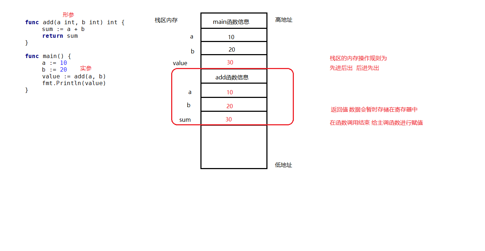
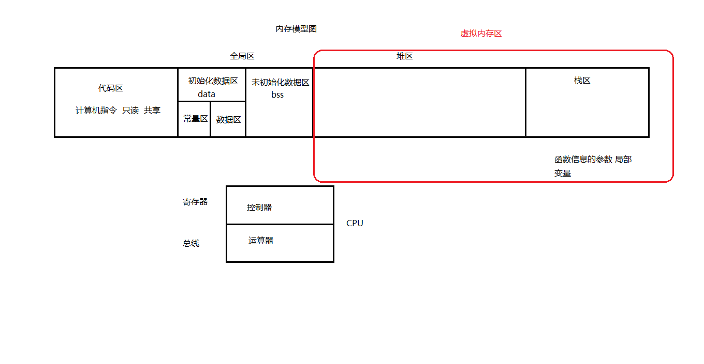
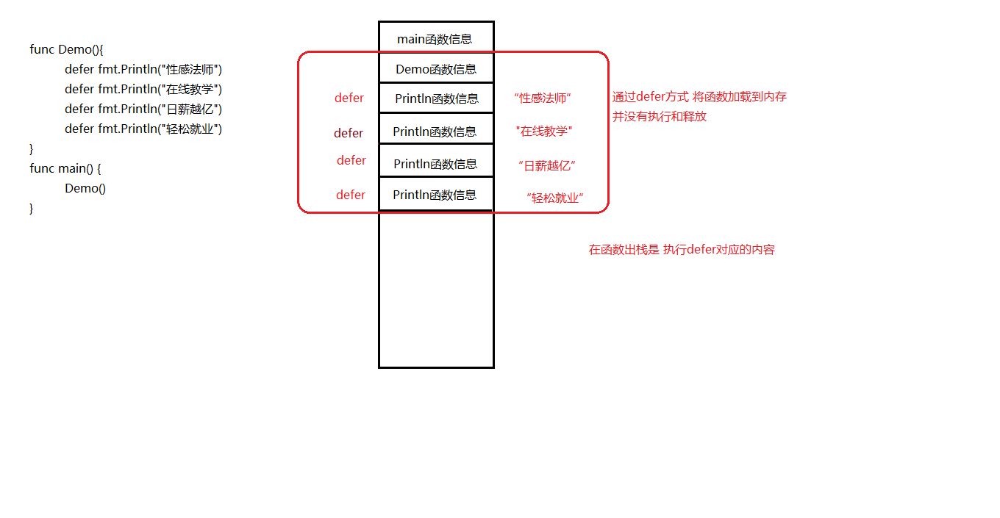
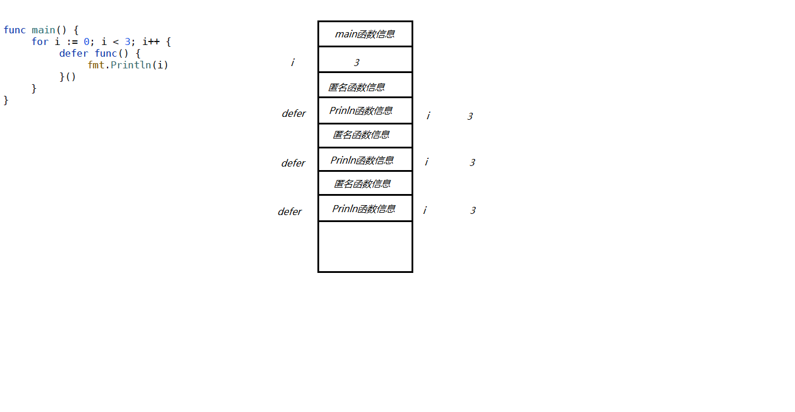
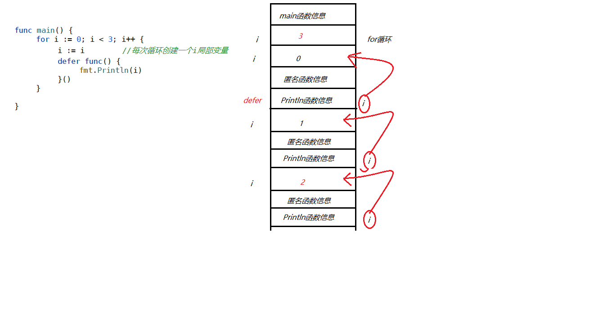
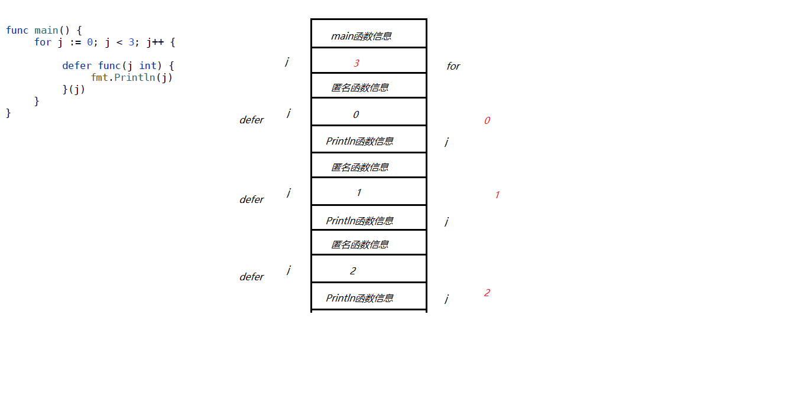
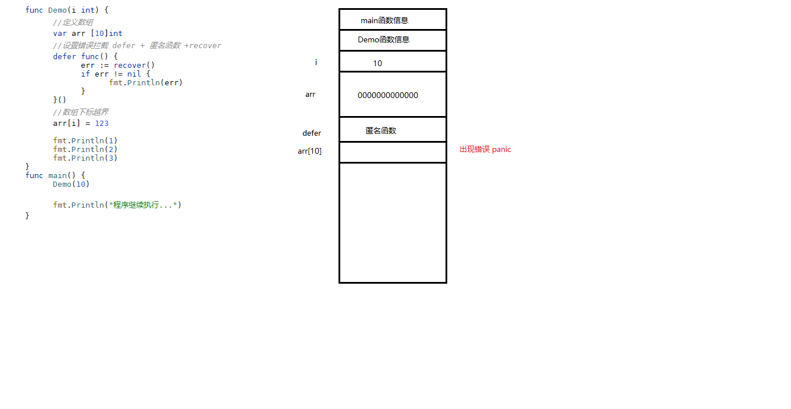
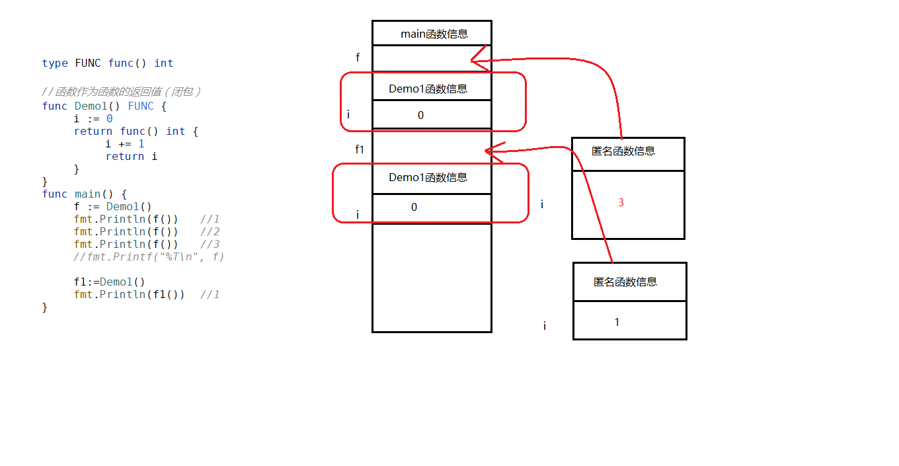
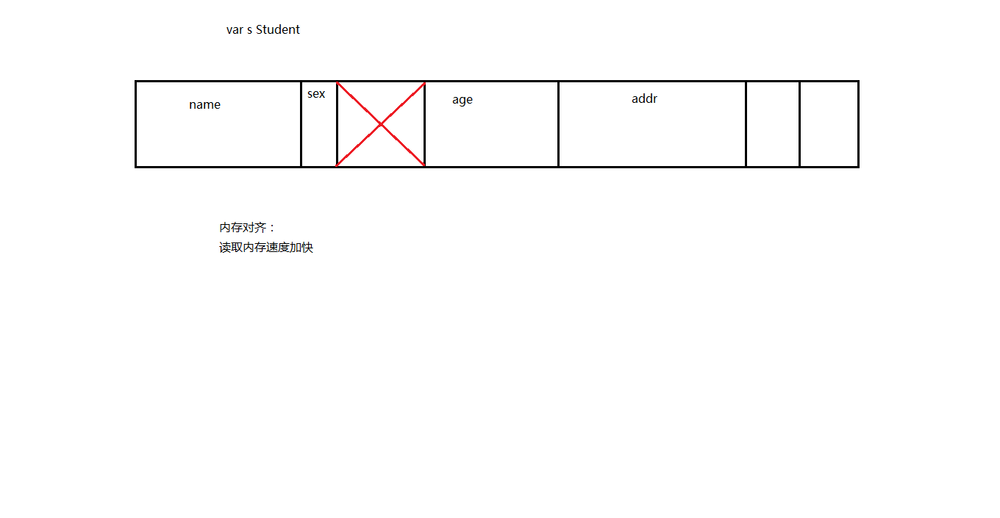

# 函数和闭包

## 函数的执行流程

go语言不区分堆栈，把堆栈封装为虚拟内存，供使用，函数执行按照 栈 的执行顺序


从 main 函数开始执行，按照 栈 顺序执行



内存分配



## defer延迟调用

- 释放占用资源
- 捕捉处理异常
- 输出日志



Eg1：




Eg2:




Eg3:



## recover错误拦截

- 编辑时异常
- 编译时异常
- 运行时异常


设置错误拦截 defer + 匿名函数 + recover


出现错误信息，当前函数不在向下继续执行，销毁当前函数信息，继续往下执行


 


## 闭包

**闭包是将函数和函数外部连接起来的桥梁**

- 读取函数内部的变量
- 变量的值始终保存在内存中


**注意：**

闭包会使得变量都保存在内存中，内存内存消耗大，滥用闭包造成网页性能下降，ie内存泄漏。

**解决办法：**退出函数之前将不使用的局部变量全部删除



# 结构体和匿名字段

注意内存对齐



## 空结构体

- 有内存地址（固定），不占用内存空间，避免内存滥用
- 在特殊的channel中使用 不可以写入数据 只有close关系才能进行输出操作


## 结构体标签

```go
type People struct {
   Name string `json:"name"`
   Age int `json:"age"`
}
func main() {
   // 通过反射获取 tag 设置
   to := reflect.TypeOf(People{})
   fmt.Printf("%T\n", to)
   for i := 0; i < to.NumField(); i++ {
      field := to.Field(i)
      tag := field.Tag.Get("json")
      fmt.Println(tag)
   }
}
```


## 匿名字段

同名字段问题

```go
type people struct {
   Name string
   Age int
}

type student struct {
   people
   Score int
   Name string
}

func main() {
   s := student{people{"张三", 18},100, "ss"}
   fmt.Println(s)
   fmt.Println(s.Name)
	 fmt.Println(s.people.Name)
}

{{张三 18} 100 ss}
ss
张三
```

# 方法

##  方法定义：

 func (方法接收者) 方法名 (参数列表)(返回值列表){}

 

**值对象接受者**

- 无需修改对象
- 引用类型、字符串 函数
- 调用时会按照其一个副本来执行调用

```go
func (s Student1) SayHello() {
   fmt.Println(s.Name, "：Hello!")
   s.Name = "ss"
}
```

**指针对想接受者**

- 需要修改数据
- 大对象的地址
- 按照实际的值来调用执行

```go
func (s *Student1) SayHello1() {
   fmt.Println(s.Name, "：Hello1!")
   s.Name = "ss1"
}
```

## 继承和重写

同一个对象的方法名不能重名

```go
type People1 struct {
   Name string
   Age int
}

// 建议使用指针对象接受者（引用）
func (p *People1) GetName(){
   fmt.Println("People1")
   fmt.Println(p.Name)
}

type Student2 struct {
   People1
   Score int
}

func (p *Student2) GetName(){
   fmt.Println("Student2")
   fmt.Println(p.Name)
}

func main() {
   // 子类继承父类   子类可以使用父类结构体成员属性  可以使用父类方法
   s := Student2{People1{"老四", 23}, 101}
   s.GetName()
}
```


# 接口


```go
package main

import "fmt"

type Humaner interface {
   SayHello()
}

type Student3 struct {
   name string
   age int
   score int
}

func (s *Student3) SayHello()  {
   fmt.Println("hello Student3  ", s.name)
}

// 多态 将接口作为函数参数

func SayHello(h Humaner)  {
   h.SayHello()
}
func main() {
   stu := Student3{"张三", 18, 101}
   stu.SayHello()

   // 定义接口类型变量
   var h Humaner
   // 必须将对象的地址赋值给接口类型变量
   h = &stu
   h.SayHello()


   // 多态
   SayHello(&stu)
}
```

